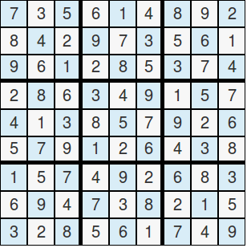
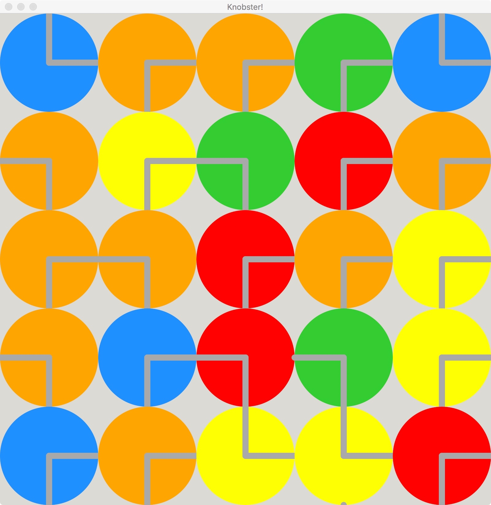

#  CSCI 1103 Computer Science 1 Honors

### Fall 2020

Robert Muller - Boston College

------

## Problem Set 10: Sudoku & Friends

#### Assigned: Suday November 22, 2020

#### Due: Friday December 11, 2020, midnight

#### Points: 20

This is a pair project. Let a staffer know if you need help finding a partner.

There are two official options:  a [sudoku](https://sudoku.com/) solver or the [knobster](https://mazechazer.gitlab.io/knobster/) game, but for this final project, feel free to freelance with one of the following

+ [2048](https://play2048.co/)
+ [Checkers](https://cardgames.io/checkers/)
+ [Tetrus](https://www.freetetris.org/game.php)
+ [A Visualization for the Needleman-Wunsch Alignment Algorithm](https://en.wikipedia.org/wiki/Needleman%E2%80%93Wunsch_algorithm)

Or, propose your own project. **If you plan to propose your own project, you'll need to clear it with the instructor by Friday November 27.**

---

## 1. Sudoku

A [sudoku puzzle](https://www.websudoku.com/) is a perfect-square grid containing zero or more non-zero digits. A *solution* of a sudoku puzzle is an arrangement of digits in the grid such that each row, column and subgroup have unique non-zero digits. For example, a solution of a 9 x 9 sudoku puzzle is:

 

Watch the [the complexity zoo](https://www.youtube.com/watch?v=YX40hbAHx3s&t=1s) to learn a bit about the relative difficulty of *solving* a sudoku problem vs *checking* to see whether a proposed solution is actually a solution. (Computationally speaking, the former is hard while the latter is easy.)

For key technical challenge for this option is to implement the process that a human might use to complete a sudoku puzzle. We'd probably find the first open space by scanning top-to-bottom and left-to-right, and try the lowest number there. We'd confirm that it checks out (row, column and section-wise) before moving on to the next open space. If it didn't check out, we'd try the next number and so on up through 9. If none of them checked out, we'd probably back up to the previous choice-point to see if we might make progress by incrementing the number there.

This option comes with a pretty significant amount of harness code for using the `Animate.start` function to represent and display a sudoku puzzle. The code for *updating* the model has been elided. If you choose this option, you are free to use any or all of the harness code, **including none of it**.

But one of the key ideas is this: This can be approached as a model-view-update application. If we approach it this way,  how can we remember the sequence of choices that we've made? It turns out to be useful to include a [stack](https://caml.inria.fr/pub/docs/manual-ocaml/libref/Stack.html) in the model. An entry on the stack would include what we need to know about a choice: the number chosen as well as the row and column number where the choice was made.

```ocaml
type play = { row : int
            ; col : int
            ; number : int
            }
type memory = play Stack.t
```

Given these definitions, you might use

+ the `Stack.create` function to create a new stack ready to record plays/choices;
+ the `Stack.is_empty` function to detect if the stack is empty;
+ the `Stack.push` function to save/record a play/choice;
+ the `Stack.pop` function to retrieve the most recent play/choice.

Then we might define a `model` as follows:

```ocaml
type entry = { n : int
             ; fixed : bool    (* Is this number given or is it one of my choices? *)
             }
type board = entry array array

type state = Paused | Running | Solved

type model = { state  : state
             ; memory : memory
             ; board  : board
             }
```

This is a very challenging option. If you choose to take it on, you should be prepared to deal with significant technical challenges.

#### One Week Milestone

It would be reasonable to be able to fill all of the holes on the board with possibly incorrect numbers by the end of the first week.  In the second week, you should implement what is required to detect when something is wrong and to try a new number, together with the logic using the stack to back up to the previous choice point.

---

## 2. Knobster

The game of [knobster](https://mazechazer.gitlab.io/knobster/) consists of a 2D grid of colored knobs with "wires" on their surfaces. When the player selects a knob, it rotates clockwise by 90 degrees. If the wires of the rotated knob connect to the wires on an adjacent knob, then the adjacent knob takes the color of the rotated knob and is marked. After a short delay, all marked knobs are rotated and the process continues. The player wins the game when all knobs have the same color.

Note well! This option is a blank slate -- there is no harness code at all!



#### Step 1: Make a Knob

As a first step in solving the problem, define types

```ocaml
type direction = North | East | South | West

type knob = { direction : direction; ... }
```

where type `knob` has all of the properties that you think might be required. Among other things, a `knob`  requires a `direction`, say as determined by the forward (clockwise) wire. Implement code that uses the Animate library to display an image of a knob.

> **Suggestion** :
>
> 1. Consider defining a `knobToString: knob -> string` function so you can print out the representation of a knob for debugging purposes.
> 2. The tricky part here is the placement of the wire. Things will be easier if you use two single segment lines rather than one two-segment line. **Remember that the y-axis runs from top to bottom so be careful with the `sin` function!**

#### Step 2: Make a Knob Turn

Modify the code from step 1 so that a knob responds to a mouse click. If the user clicks on the knob, it should smoothly rotate clockwise by 90 degrees and then stop. Continued clicking should cause continued clockwise rotation.

This step requires you to use the `~onMouse` input to the `Animate.start` function. Remember that the function provided for the `~onMouse` input looks like:

```ocaml
let handleMouse model x y event = ...

...

let go () =
  Animate.start model
    ...  
    ~view:  view
    ~onTick : update
    ~onMouse: handleMouse
    ...
```

The mouse `event` that should trigger the rotation is the string `"button_up"`.

> **Suggestion**:
>
> Now a knob is either rotating or it's stationary. Consider defining a type
>
> ```ocaml
> type state = Steady | Turning
> ```
>
> and consider including this state as part of the type `knob`. The `handleMouse` function should change the state of the knob from `Steady` to `Turning`. The `update` function should leave a `Steady` knob alone. The `update` function should cause a knob in the `Turning` state to rotate clockwise in small steps until it has completed 90 degrees of rotation. Once this is completed, the knob should have the new direction and be placed in the `Steady` state.

#### Step 3: Make a 2D Grid of Knobs

Modify the code from step 2 so that the `model` is not a knob but rather a 2D grid of knobs. Consider

```ocaml
type grid = knob array array

type model = { grid : grid }
```

Your modification of the code from part 2 should cause a knob to rotate when clicked. This requires a mapping between the `x` and `y` values passed to the `handleMouse` function and the row and column of the knob in the grid. Of course the `x` value should be used in computing the column and the `y` value should be used in computing the row.

The `update` function now needs to update all of the knobs in the grid and the `view` function now needs to display all of the knobs.

#### Step 4: Implement the Wire Logic

Now that you've completed steps 1 through 3, all that is left to do is to implement the logic in which the wires of a turned knob connect up properly with wires of adjacent knobs.

> **Suggestion:**
>
> 1. In order to implement the pause that occurs after a knob is rotated, consider modifying the type
>
>    ```
>    type state = Steady | Turning | Marked of int
>    ```
>
>    When the `update` function is updating a knob in state `Marked n` for n > 0, it leaves the knob in state `Marked (n - 1)`. When the `update` function is updating a knob with state `Marked 0`, the delay is finished so the `update` function changes the state of the knob to `Turning`.
>
> 2. If a knob is clicked, how to find the adjacent knobs? Consider including the knob's row and column in its representation.

This is a challenging problem! Stop in to discuss it.

#### One Week Milestone

For this problem, you should try to complete steps 1 and 2 in the first week and steps 3 and 4 in the second week.
